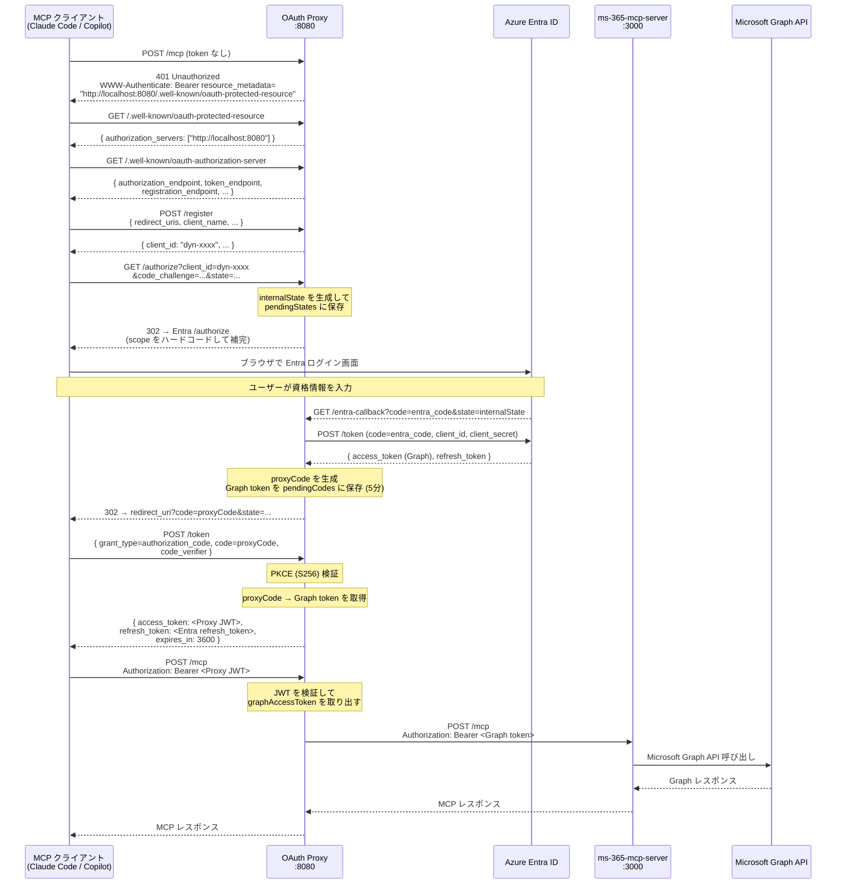
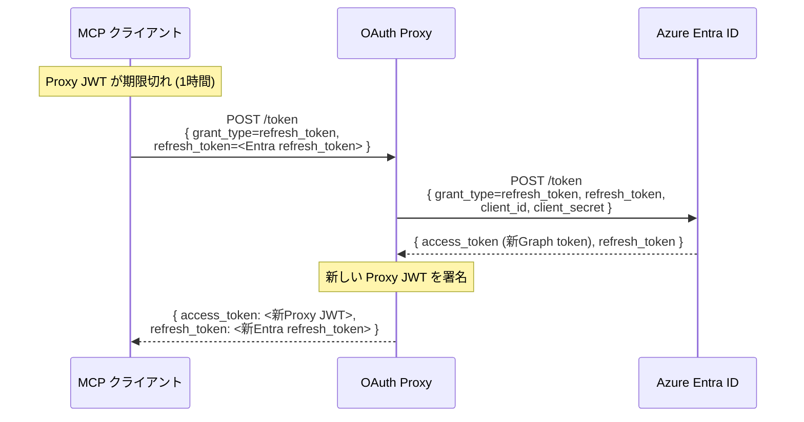

# MS365 MCP Server — OAuth Proxy 構成ガイド

ユーザーに渡す情報は **MCP の URL 1 つだけ**。Azure Entra のテナント ID・クライアント ID はサーバー側に秘匿する構成。

---

## アーキテクチャ概要

```
┌──────────────────────────────────────┐
│  MCP クライアント                     │
│  (Claude Code / GitHub Copilot)      │
│  知っているのは MCP URL のみ          │
└──────────────┬───────────────────────┘
               │ http://localhost:8080/mcp
               ▼
┌──────────────────────────────────────┐
│         OAuth Proxy (port 8080)      │
│                                      │
│  /.well-known/oauth-protected-resource│
│  /.well-known/oauth-authorization-server│
│  POST /register   ← DCR (RFC 7591)  │
│  GET  /authorize  → Entra へ転送    │
│  GET  /entra-callback ← Entra から  │
│  POST /token      → JWT を発行      │
│  ALL  /mcp        → backend へ転送  │
└──────────────┬───────────────────────┘
               │ Authorization: Bearer <Graph token>
               ▼
┌──────────────────────────────────────┐
│  ms-365-mcp-server (port 3000)       │
│  localhost のみ公開                   │
└──────────────┬───────────────────────┘
               │
               ▼
        Microsoft Graph API
```

---

## 認証フロー（初回）



---

## トークンリフレッシュフロー



---

## コンポーネント詳細

### OAuth Proxy (`proxy/proxy.js`)

| エンドポイント | 役割 |
|---|---|
| `GET /.well-known/oauth-protected-resource` | Proxy 自身を AS として宣言 |
| `GET /.well-known/oauth-authorization-server` | OAuth メタデータ（DCR エンドポイント含む）|
| `POST /register` | Dynamic Client Registration (RFC 7591) |
| `GET /authorize` | Entra /authorize へリダイレクト（scope を補完）|
| `GET /entra-callback` | Entra からのコールバック受信、プロキシコード発行 |
| `POST /token` | PKCE 検証 → Proxy JWT 発行 / refresh_token 更新 |
| `ALL /mcp` | JWT 検証 → Graph token に差し替えてバックエンドへ転送 |
| `GET /health` | ヘルスチェック |

### ms-365-mcp-server (`src/`)

- HTTP Bearer モードで起動（`--http 127.0.0.1:3000`）
- `Authorization: Bearer <Graph token>` を受け取り Graph API を呼び出す
- **外部に直接公開しない**（localhost のみ）

---

## セキュリティ設計

| 脅威 | 対策 |
|---|---|
| Entra 認証情報の漏洩 | Proxy のみが client_id / client_secret を保持 |
| CSRF 攻撃 | state パラメーター（internalState）で防止 |
| 認可コードの横取り | PKCE (S256) で防止 |
| プロキシコードの使い回し | 使用後即座に削除、5分で期限切れ |
| JWT の改ざん | HMAC-SHA256 署名 (jose ライブラリ) |
| バックエンドへの直接アクセス | localhost バインドで外部公開しない |
| トークンのログ漏洩 | UPN のみログ出力、token 値は出力しない |

---

## 既知の問題と対策

### Claude Code — scope パラメーター未送信バグ (Issue #4540)

**症状**: OAuth 認可リクエストに `scope` が含まれない場合がある。  
**対策**: Proxy の `/authorize` で `graphScopes` をハードコードして Entra に送信。

### Entra ID — DCR 非対応

**症状**: Entra は RFC 7591 をサポートしない。  
**対策**: Proxy 自身が `/register` エンドポイントを実装してクライアントを動的発行。

### インメモリストアの制限

`dynamicClients` / `pendingStates` / `pendingCodes` はメモリ上に保持。  
プロセス再起動で消えるため、本番運用では Redis 等に置き換える。

| ストア | 推奨 TTL |
|---|---|
| `dynamicClients` | 無期限（または長期）|
| `pendingStates` | 10 分 |
| `pendingCodes` | 5 分 |

---

## 起動方法

```bash
# 1. ms-365-mcp-server 起動 (port 3000)
pnpm dev:http
# → 127.0.0.1:3000 でリッスン

# 2. OAuth Proxy 起動 (port 8080)
cd proxy
cp .env.example .env   # Entra 情報を記入
node proxy.js
# → 0.0.0.0:8080 でリッスン

# 3. MCP クライアントに登録
# Claude Code
claude mcp add --transport http ms365 http://localhost:8080/mcp

# GitHub Copilot (VS Code)
# .vscode/mcp.json に以下を追記:
# { "servers": { "ms365": { "type": "http", "url": "http://localhost:8080/mcp" } } }
```

## 接続確認

```bash
# PRM エンドポイント（Proxy 自身が AS として返ること）
curl http://localhost:8080/.well-known/oauth-protected-resource

# AS メタデータ（registration_endpoint が含まれること）
curl http://localhost:8080/.well-known/oauth-authorization-server

# 未認証アクセス → 401 + WWW-Authenticate ヘッダー
curl -i -X POST http://localhost:8080/mcp \
  -H "Content-Type: application/json" \
  -d '{"jsonrpc":"2.0","id":1,"method":"tools/list","params":{}}'

# ヘルスチェック
curl http://localhost:8080/health
```

---

## 必要な Entra アプリ設定

| 設定項目 | 値 |
|---|---|
| アプリの種類 | パブリッククライアント または 機密クライアント |
| リダイレクト URI | `http://localhost:8080/entra-callback` |
| サポートするアカウント | シングルテナント（社内利用推奨）|
| API のアクセス許可 | User.Read, Mail.*, Calendars.*, Files.* 等（管理者の同意推奨）|
